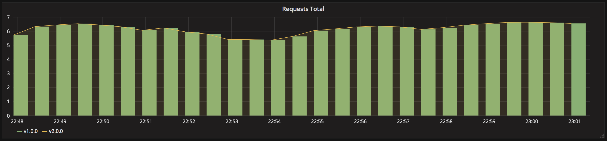
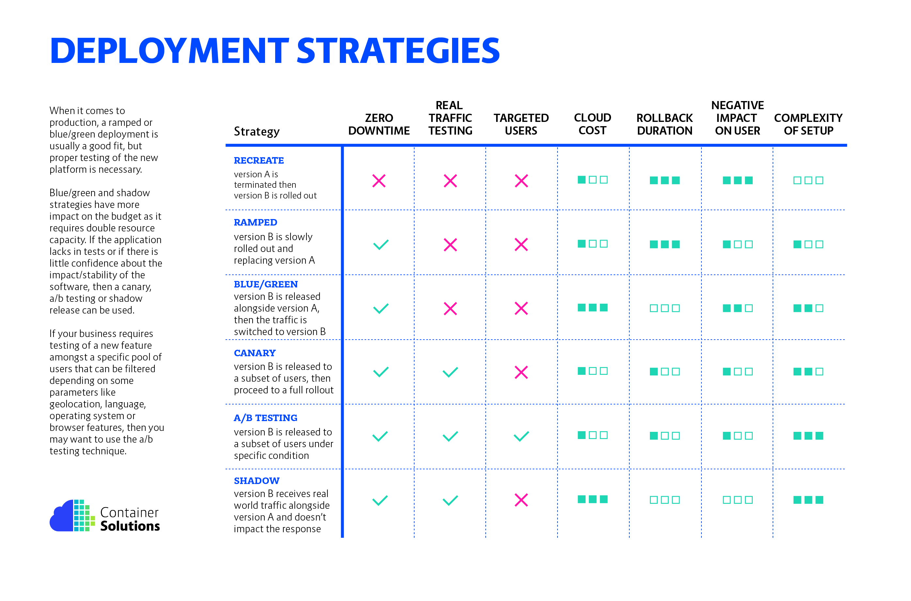

# Introduction to Kubernetes

Editors: **Kaan Keskin, Sezen Erdem**

Date: November 2021

Available at: https://github.com/kaan-keskin/introduction-to-kubernetes

**Resources:**

> - Kubernetes Documentation - https://kubernetes.io/docs/home/
> - Kubernetes in Action - Marko Lukša 
> - Kubernetes Fundamentals (LFS258) - The Linux Foundation
> - Kubernetes for Developers (LFD259) - The Linux Foundation
> - Getting Started with Kubernetes - Sander van Vugt - Addison-Wesley Professional

**LEGAL NOTICE: This document is created for educational purposes, and it can not be used for any commercial purposes. If you find this document useful in any means please support the original authors for ethical reasons.** 

[Return to the README page.](README.md)

# Kubernetes Deployment Strategies

In Kubernetes there is few different way to release an application, you have to carefully choose the right strategy to make your infrastructure resilient.

- **Recreate**: Terminate the old version and release the new one.

- **Ramped**: Release a new version on a rolling update fashion, one after the other.

- **Blue/Green**: Release a new version alongside the old version then switch traffic.

- **Canary**: Release a new version to a subset of users, then proceed to a full rollout.

- **A/B Testing**: Release a new version to a subset of users in a precise way (HTTP headers, cookie, weight, etc.). This doesn’t come out of the box with Kubernetes, it imply extra work to setup a smarter loadbalancing system (Istio, Linkerd, Traeffik, custom nginx/haproxy, etc).

- **Shadow**: Release a new version alongside the old version. Incoming traffic is mirrored to the new version and doesn't impact the response.

Before experimenting, checkout the following resources:
- [CNCF prensentation](https://www.youtube.com/watch?v=1oPhfKye5Pg)
- [CNCF prensentation slides](https://www.slideshare.net/EtienneTremel/kubernetes-deployment-strategies-cncf-webinar)
- [Kubernetes deployment strategies](https://container-solutions.com/kubernetes-deployment-strategies/)
- [Six Strategies for Application Deployment](https://thenewstack.io/deployment-strategies/).
- [Canary deployment using Istio and Helm](https://github.com/etiennetremel/istio-cross-namespace-canary-release-demo)
- [Automated rollback of Helm releases based on logs or metrics](https://container-solutions.com/automated-rollback-helm-releases-based-logs-metrics/)

